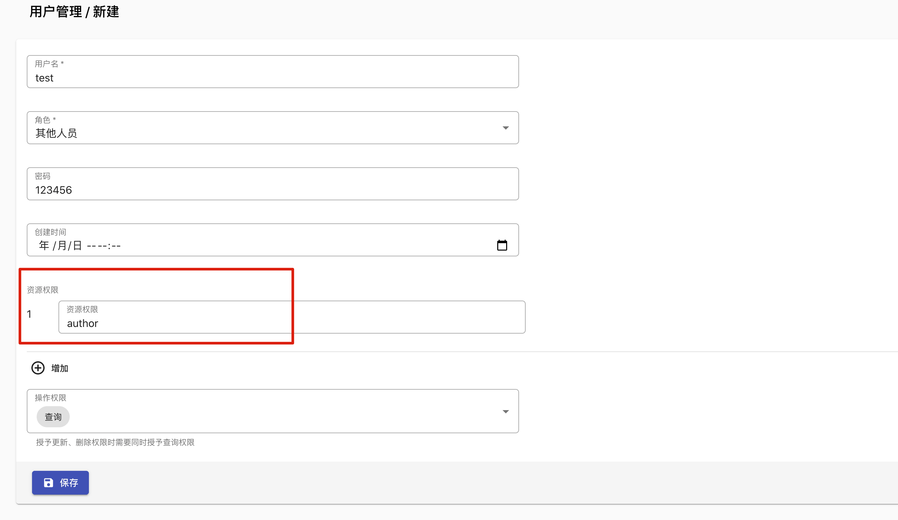

# 云开发 CMS 内容管理系统扩展

## 运行方式

恭喜你完成 CMS 扩展的安装，现在就可以访问自己的 CMS 系统来管理云开发数据了

### 1. 访问 CMS 系统

CMS 扩展已经部署在当前环境下的静态网站托管中，访问路径为“静态托管的默认域名+安装设置的部署路径”

访问地址的格式如下：

`云开发静态托管默认域名/部署路径`，例如 `https://xxxx.tcloudbaseapp.com/tcb-cms/`,

查看云开发静态托管默认域名方式：

打开 [静态托管控制台](https://console.cloud.tencent.com/tcb/hosting/index?tabId=config)，切换到对应的环境来查看默认域名

注意：云开发提供的默认域名下行速度限制为 100 KB/s，建议绑定自定义域名来提升访问速度

### 2. 账号登录

打开 CMS 系统后首先会提示需要登录，我们首先使用使用安装扩展时设置的管理员账号和密码进行登录


| CMS 系统角色权限一览 | 管理员 | 运营者 | 其他人员 | 功能介绍                                                                                      |
| -------------------- | ------ | ------ | --------------------------------------------------------------------------------------------- | --------------------------------------------------------------------------------------------- |
| 内容建模设置         | ✅     | ❌     | ❌    | 开发者可以根据数据库字段进行内容建模设置，并自动生成管理界面                                  |
| Webhook 设置         | ✅     | ❌     | ❌    | Webhook 可以用于在运营人员修改内容数据后，自动回调外部系统，比如自动构建静态网站、发送通知等" |
| 内容管理             | ✅     | ✅     | 部分   | 通过 CMS 界面，对云开发数据中的文本、富文本、图片、文件、关联类型等多种内容类型的可视化编辑   |

### 3.内容建模

登录成功后，首先需要进行内容的建模设置，例如我们想为自己的博客应用（小程序/网站）来生成管理界面。

假设当前已有两个数据库集合（如果集合不存在，CMS 系统会自动生成对应的集合）

集合 `articles`，用来存放文章信息

| 字段名     | 类型     | 描述                                         |
| ---------- | -------- | -------------------------------------------- |
| \_id       | ID       | 文章唯一 id                                  |
| name       | String   | 文章标题                                     |
| cover      | String   | 封面图，这里存放云开发的存储的文件的 cloudID |
| content    | String   | 文章内容，采用 markdown 格式                 |
| author     | ID       | 作者的用户 id                                |
| createTime | DateTime | 创建时间                                     |
| updateTime | DateTime | 更新时间                                     |
| tag        | String[] | 标签，例如 `["serverless","cms"]`            |
| category   | String[] | 分类，例如 `["前端","开发"]`                 |

集合 `users`，用来存放用户信息

| 字段名 | 类型   | 描述        |
| ------ | ------ | ----------- |
| \_id   | ID     | 用户唯一 id |
| cover  | String | 用户名      |
| openid | String | 用户 openid |
| avatar | String | 用户的头像  |

在“内容设置”中点击“新建”来创建内容类型，首先创建“用户”类型，按照如下图片来填写


点击 “保存”，回到“内容设置”列表中，已经出现一条“用户”类型的内容


然后我们继续在“内容设置”中点击“新建”来创建“文章”类型


保存成功后，刷新页面，可以看到运营区域已经出现了“文章”和“用户”类型


### 4.管理数据

接下来就可以进行运营操作了，可以使用运营者身份登录，对新创建的“文章”和“用户”进行操作。


点击“新建”，创建一个用户


创建成功后，可以在“用户“列表页面进行查看、编辑和删除


然后我们再新建一篇文章


发布成功后，即可在列表中查看这篇文章


### 5.使用数据

使用 CMS 管理的内容，依然可以通过云开发各端 SDK 进行访问（需要注意数据库的安全规则设置）。

例如，我们需要在云函数中获取标签是 `CloudBase` 的最新 10 条文章，可以采用以下代码：

```javascript
db.collection("articles")
  .where({ tag: "CloudBase" })
  .orderBy("createTime", "desc")
  .limit(10)
  .get();
```


### 注意事项

- 注意在内容建模完成后，已经添加过内容数据的情况下，请谨慎修改建模字段（特别是修改字段类型或者删除字段），避免出现不兼容的情况

### 6. 用户管理

CMS 系统提供了基础的用户管理体系，包含了以下三种角色：

- 管理员：拥有全部的管理权限，包含内容建模，Webhook 设置，用户管理，内容管理等
- 运营人员：拥有全部的内容管理权限，包括新建，查看，更新，删除内容等
- 其他人员：用户部分内容的部分权限，可分别授予内容新建，查看，更新，删除中的任意一项或多项权限


新建用户，设置用户名、密码、可以操作的数据库名，以及对应的权限

