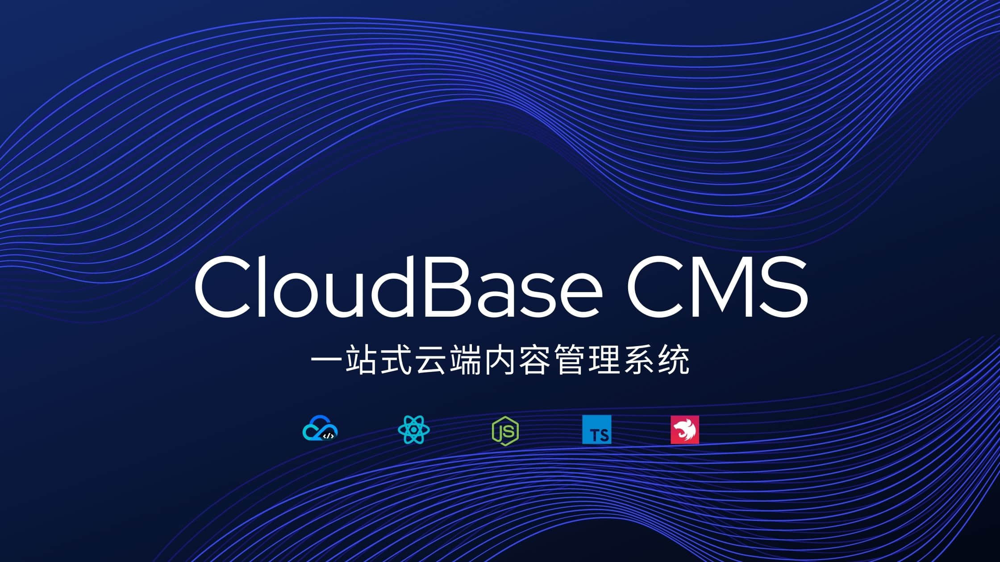

# CloudBase CMS

<!-- ALL-CONTRIBUTORS-BADGE:START - Do not remove or modify this section -->

<!-- ALL-CONTRIBUTORS-BADGE:END -->

  
  <h3 align="center">
    打造一站式云端内容管理系统
  </h3>
  

     
    <a href="https://cms-demo-1252710547.tcloudbaseapp.com">
      <strong>✨ 在线示例（账号密码见微信群公告）»</strong>
    </a>
     
     
    <a href="https://docs.cloudbase.net/cms/intro.html" target="_blank">文档</a>
    ·
    <a href="https://github.com/TencentCloudBase/cloudbase-extension-cms/issues">报告 Bug</a>
    ·
    <a href="https://github.com/TencentCloudBase/cloudbase-extension-cms/issues">特性建议</a>
  

CloudBase CMS 是云开发推出的，基于 Node.js 的 Headless 内容管理平台，提供了丰富的内容管理功能，安装简单，易于二次开发，并与云开发的生态体系紧密结合，助力开发者提升开发效率。

## 功能特性

| 特性       | 介绍                                                                       |
| ---------- | -------------------------------------------------------------------------- |
| 免开发     | 基于模板配置生成内容管理界面，无须编写代码                                 |
| 功能丰富   | 支持文本、图片、文件、枚举等多种类型内容的可视化编辑，并且支持内容关联     |
| 权限控制   | 基于自定义角色的资源级权限管理，满足企业级需求                             |
| 系统集成   | 支持 Webhook 触发，可以方便的与外部系统集成                                |
| 数据源兼容 | 支持管理已有的云开发数据，也可以在 CMS 后台创建新的内容和数据集合          |
| 部署简单   | 可在云开发控制台扩展管理界面一键部署和升级，也可通过项目提供的脚本自动部署 |

## 🚀 快速开始

你可以通过下面的方式快速部署 CloudBase CMS

<!-- ### 一键部署

使用一键部署，将 CMS 部署到云托管。

**注：一键部署使用云托管部署，将会运行费用，计费标准[参考文档](https://cloud.tencent.com/document/product/1243/48037)。** -->

### 扩展安装

在[云开发控制台](https://console.cloud.tencent.com/tcb/extensions/index)安装

### 源码部署

参考 CMS 使用说明[文档](https://docs.cloudbase.net/cms/install/source.html)

## [示例](https://cms-demo-1252710547.tcloudbaseapp.com)

## 技术栈

- ❤️ React
- ❤️ Node.js + Nest.js + [CloudBase](https://cloudbase.net)
- ❤️ TypeScript

## 使用案例

<table>
  <tr>
    <td align="center"><a href="https://cloudbase.net">
      
       <b>云开发</b></a>
    </td>
    <td align="center">
      <a href="https://face.xiaoxili.com/">
       
      <b>Hi 头像</b>
    </a>
    </td>
    <td align="center"><a href="https://featwork.com/blog">
      
       <b>轻博客</b></a>
    </td>
    <td align="center">
      
       <b>密鸭车服</b>
    </td>
    <td align="center"><a href="https://github.com/wforguo/wedding-app">
      
       <b>趣婚礼</b></a>
    </td>
    <td align="center">
      
       <b>实时地震</b>
    </td>
    <td align="center">
      
       <b>嘻哈F</b>
    </td>
  </tr>
</table>

## RoadMap

🚀 表示已经实现的功能，👷 表示进行中的功能，⏳ 表示规划中的功能，🏹 表示技术方案设计中的功能。

| 功能                                             | 状态      | 发布版本 |
| ------------------------------------------------ | --------- | -------- |
| 字段禁止编辑                                     | 👷 进行中 |          |
| 图片、文件支持上传多个                           | 👷 进行中 |          |
| 批量更新文档                                     | 👷 进行中 |          |
| 提供项目模板，支持从模板创建项目                 | 🏹 设计中 |          |
| 支持操作记录                                     | 🏹 设计中 |          |
| 支持 GraphQL                                     | ⏳ 规划中 |          |
| 地图组件                                         | ⏳ 规划中 |          |
| 内容表字段索引支持                               | ⏳ 规划中 |          |
| 定时任务 ⇒ 统计报表                              | ⏳ 规划中 |          |
| 支持显示、检索 \_id 字段                         | 🚀 已完成 | V2.10    |
| 支持创建微应用，嵌入自定义 Web 页面              | 🚀 已完成 | V2.10    |
| 支持保存检索字段                                 | 🚀 已完成 | V2.6     |
| 富文本支持输入链接插入图片                       | 🚀 已完成 | V2.6     |
| 新增多媒体类型，支持上传并播放视频、音乐         | 🚀 已完成 | V2.6     |
| 支持默认排序字段                                 | 🚀 已完成 | V2.5     |
| 支持复制内容模型                                 | 🚀 已完成 | V2.4     |
| 支持导出数据到 CSV、JSON 文件                    | 🚀 已完成 | V2.4     |
| 支持云应用部署                                   | 🚀 已完成 | V2.4     |
| 支持修改系统内置的创建时间、修改时间等字段的属性 | 🚀 已完成 | V2.4     |
| 支持 RESTful API                                 | 🚀 已完成 | V2.3     |
| 模型字段支持拖拽排序                             | 🚀 已完成 | V2.1     |
| 模型支持导入、导出                               | 🚀 已完成 | V2.1     |
| 支持 JSON 对象                                   | 🚀 已完成 | V2.1     |
| 支持通过 CSV，JSON Line 导入数据                 | 🚀 已完成 | V2.1     |
| 图片、文件数组支持                               | 🚀 已完成 | V2.1     |
| CMS 2.0 使用文档                                 | 🚀 已完成 | V2.0     |
| 富文本编辑器优化，支持上传图片                   | 🚀 已完成 | V2.0     |
| 登录使用云开发账号密码登录                       | 🚀 已完成 | V2.0     |
| 支持枚举类型                                     | 🚀 已完成 | V2.0     |
| 细粒度角色权限管理权限控制                       | 🚀 已完成 | V2.0     |

## 在线交流

如果在使用、安装过程中有任何问题，或者建议，欢迎加群讨论、反馈问题

  

    扫描二维码，长按识别出现的二维码，即可加群
  

  
  

## 🤝 贡献指南

欢迎大家参与到 CloudBase CMS 的开发工作，贡献一份力量

您可以选择如下的贡献方式：

- 贡献一篇技术文章
- 贡献代码，提交 Pull Request
- 反馈 bug，提交 Issue
- 在技术会议上发表技术演讲
- 贡献方式请参考 贡献指南 文档

### 本地开发

参考[贡献指南](./CONTRIBUTING.md)

## 更新日志

见[更新日志](./CHANGELOG.md)

## 📝 License

开源协议文档请参阅 [Apache License 2.0](./LICENSE)

## Contributors ✨

贡献人员

<!-- ALL-CONTRIBUTORS-LIST:START - Do not remove or modify this section -->
<!-- prettier-ignore-start -->
<!-- markdownlint-disable -->
<table>
  <tr>
    <td align="center"><a href="https://github.com/chhpt"> <b>chhpt</b></a> <a href="#infra-chhpt" title="Infrastructure (Hosting, Build-Tools, etc)">🚇</a> <a href="https://github.com/TencentCloudBase/cloudbase-extension-cms/commits?author=chhpt" title="Code">💻</a> <a href="https://github.com/TencentCloudBase/cloudbase-extension-cms/commits?author=chhpt" title="Documentation">📖</a></td>
    <td align="center"><a href="https://github.com/binggg"> <b>Booker Zhao</b></a> <a href="https://github.com/TencentCloudBase/cloudbase-framework/commits?author=binggg" title="Code">💻</a></td>
    <td align="center"><a href="https://www.zzkai.com"> <b>幻魂</b></a> <a href="https://github.com/TencentCloudBase/cloudbase-extension-cms/commits?author=fantasticsoul" title="Code">💻</a></td>
    <td align="center"><a href="https://github.com/geeeeeeeeeek"> <b>June</b></a> <a href="https://github.com/TencentCloudBase/cloudbase-extension-cms/commits?author=geeeeeeeeeek" title="Code">💻</a></td>
  </tr>
</table>

<!-- markdownlint-enable -->
<!-- prettier-ignore-end -->

<!-- ALL-CONTRIBUTORS-LIST:END -->
