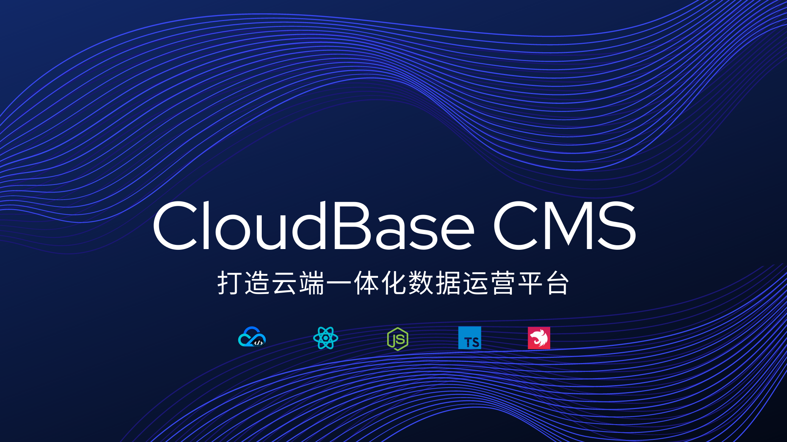

# CloudBase CMS V2



👷 施工中 🚧

## 云开发部署

我们提供了一键部署到云开发环境的脚本，你可以按照下面的流程操作，部署 CloudBase CMS 到云开发环境中。

### 0️⃣ 前置依赖

1. 安装 [Node.js LTS 版本](https://nodejs.org/zh-cn/)
2. 使用 Node 包管理器 NPM 安装最新版本的 CloudBase CLI 工具（0.9.1+）

   `npm install -g @cloudbase/cli@latest`

3. 开通云开发服务，并创建按量计费环境（如果您已拥有云开发按量计费的环境，可跳过此步骤）

   登录[腾讯云-云开发控制台](https://console.cloud.tencent.com/tcb/env/index?from=cli&source=cloudbase-cms&action=CreateEnv)，根据弹窗提示，开通服务，并创建按量计费环境。

### 1️⃣ 配置

复制项目根目录下的 `.env.example` 为 `.env.local`，并填写相关的配置

```bash
# 您的云开发环境 Id
TCB_ENVID=envId
# 管理员账户名，账号名长度需要大于 4 位，支持字母和数字
administratorName=admin
# 管理员账号密码，8~32位，密码支持字母、数字、字符、不能由纯字母或存数字组成
administratorPassword=82902Jkl
# CMS 控制台路径，如 /tcb-cms/
deployPath=/tcb-cms/
```

### 2️⃣ 安装依赖

在项目根目录下运行下面的命令：

```
npm install && npm run setup
```

### 3️⃣ 部署

在项目根目录下运行下面的命令，会将 CloudBase CMS 的管理控制台部署到静态网站，Node 服务部署到云函数中

```
npm run deploy:fn
```

## 本地开发

配置 packages/service/.env.local

```
TCB_ENVID=xxx
SECRETID=xxx
SECRETKEY=xxx
```

配置 packages/admin/public/config.js

```js
window.TcbCmsConfig = {
  // 路由模式
  history: 'hash',
  // 环境 Id
  envId: 'envId',
  // 云接入默认域名/自定义域名，不带 https 协议符
  // https://console.cloud.tencent.com/tcb/env/access
  cloudAccessPath: 'xxx.xx.tcloudbase.com/tcb-ext-cms-service',
}
```

安装依赖

```bash
# 安装 lerna 依赖
npm install
# 安装 package 依赖
npm run setup
# 启动开发
npm run dev
```

## RoadMap

🚀 表示已经实现的功能，👷 表示进行中的功能，⏳ 表示规划中的功能。

| 功能                                     | 状态 |
| ---------------------------------------- | ---- |
| 支持 RESTful API                         | 👷   |
| 数据导入、导出：支持内容数据的导入、导出 | 👷   |
| 提供项目模板，支持从模板创建项目         | ⏳   |
| 支持复杂的对象                           | ⏳   |
| 富文本编辑器优化，支持上传图片           | 🚀   |
